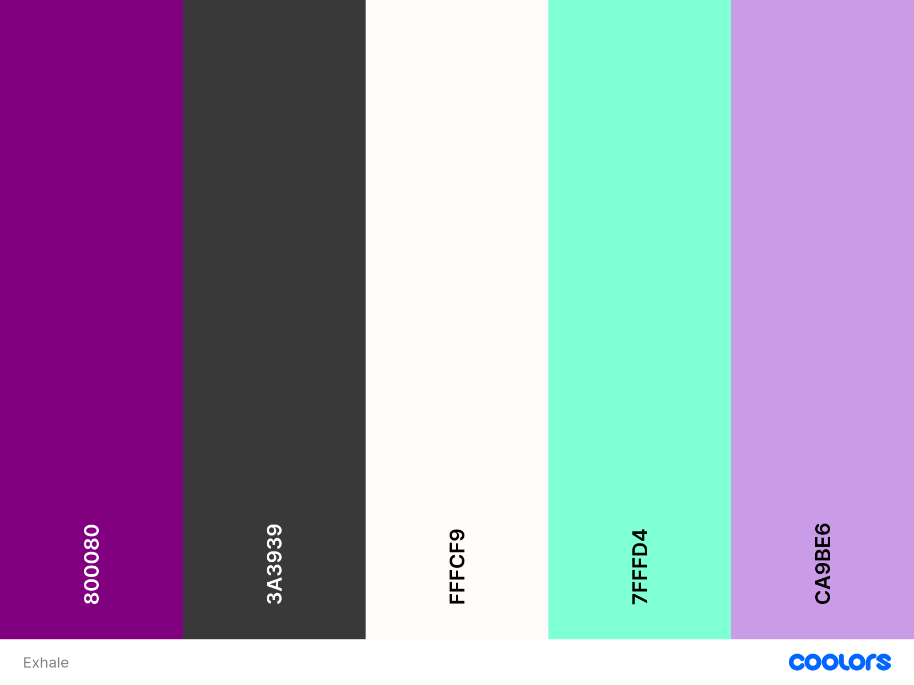
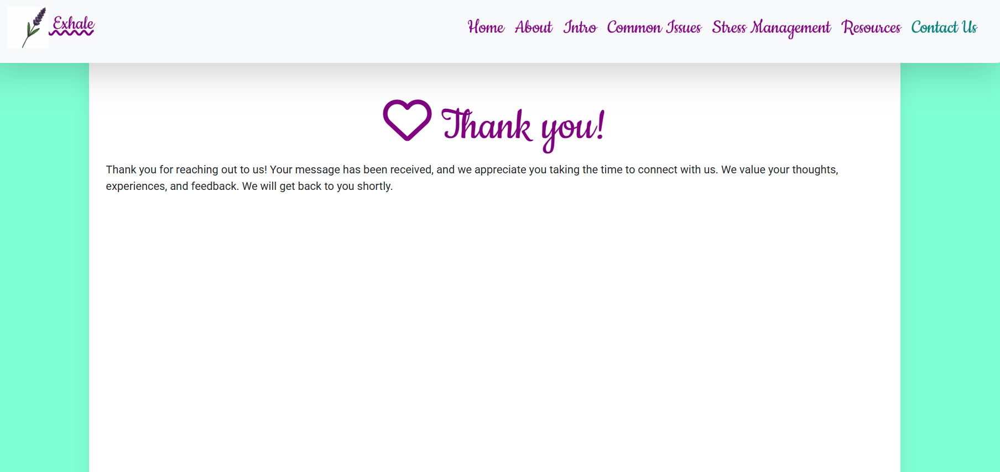
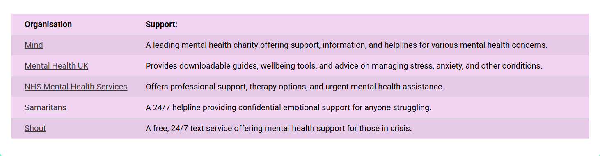

# Exhale

[| Live Project |](https://fatimahmohamed.github.io/Exhale-Mental-Health/)

## Introduction
This website is my first project, designed to educate and support individuals seeking mental health information. Built using HTML, CSS, Bootstrap, and AI-assisted elements, it offers a structured and accessible platform for users to explore key topics related to mental well-being.

The site includes an About section that explains its mission, a brief introduction to mental health, a guide to common mental health issues, practical stress management techniques, and a contact page for further engagement. Through thoughtful design and intuitive layout, this project aims to make mental health awareness more approachable and informative.

Please find a link to the live project here: [Exhale](https://fatimahmohamed.github.io/Exhale-Mental-Health/)

## Table of Contents

- [Introduction](#introduction)
- [Project Outline](#project-outline)
- [Project Planning](#project-planning)
  - [UX Design](#ux-design)
    - [User Stories](#user-stories)
  - [Colors](#colors)
  - [Fonts](#fonts)
  - [Wireframes](#wireframes)
  - [Imagery](#imagery)
- [Features](#features)
  - [General Features](#general-features)
    - [Navigation & Bootstrap Carousel](#navigation--bootstrap-carousel)
    - [Bootstrap Cards](#bootstrap-cards)
    - [Contact Form](#contact-form)
    - [Table](#table)
    - [Footer](#footer)
    - [Future Development](#future-development)
  - [Responsive Design](#responsive-design)
- [Built With](#built-with)
  - [Technology and Languages](#technology-and-languages)
  - [Libraries and Frameworks](#libraries-and-frameworks)
  - [Tools & Programs](#tools--programs)
- [AI Implementation](#ai-implementation)
  - [Code Creation](#code-creation)
  - [Debugging](#debugging)
  - [Optimize Code](#optimize-code)
  - [Reflections on AI](#reflections-on-ai)
- [Deployment](#deployment)

## Project Outline
External User’s Goal: The user seeks accessible, beginner friendly information on mental health, including how to recognise common issues and manage stress, presented in a supportive and organised layout.

Site Owner’s Goal: The site owner wants to create a welcoming webpage that provides basic mental health information using a clean and supportive design. The focus is on using HTML and CSS with Bootstrap to create a calming and well organised user experience.

## Project Planning
### UX Design
#### User Stories
- As someone experiencing stress, I want to find simple and actionable tips to reduce stress, so that I can feel calmer in my daily life.

- As a mobile user, I want the page to be responsive, so that I can easily read the content on my phone or tablet.

- As a user, I want a simple, intuitive navigation bar, so that I can quickly find information on specific mental health issues or stress management techniques.

- As a user, I want to see a list of common mental health issues (like anxiety, depression, burnout), so that I can identify what I might be experiencing.

- As a visitor, I want to find a simple introduction to mental health, so that I can understand the basics and why it's important to take care of it.

- As a user, I want to access a list of local mental health resources and helplines, so that I can find professional support if necessary.

- As a visitor, I want to find a curated list of free apps and online tools for mental health, so that I can start using them right away to track or manage my mental health.

### Colors

#### Main Palette
The color scheme should be soothing and relaxing for the visitor. Furthermore, there should be no contrast issues. As the logo for Exhale is lavender, the colours were chosen to complement it:

- H1 Headings: #800080
- Body Text: #3A3939
- Header and Footer: #FFFCF9
- Background: #7FFFD4
- Primary Button: #CA9BE6
- Secondary Button: #800080

### Fonts
The font should be easy to read and create a relaxing atmosphere for the website visitor. I decided to incorporate a cursive font to make the website more playful. The fonts were imported using [Google Fonts](https://fonts.google.com/) direct import code.

[Cookie](https://fonts.google.com/specimen/Cookie) was used for the headings and the Navbar links.

[Roboto](https://fonts.google.com/specimen/Roboto) was used for the body.

### Wireframes

#### Mobile Wireframes

#### Tablet Wireframes

#### Desktop Wireframes

### Imagery

A carousel of images was used on the home page - they include comforting and positive words relating to mental health. The cards on the common mental health issues cards and the stress management techniques cards are various nature pictures including flowers and wildlife. All the images used are royalty-free.

## Features

### General Features

#### Navigation & Bootstrap Carousel
The hero section of the homepage features five images. They include affirmations, a motivational quote and relaxing imagery.  This section was made using bootstrap’s carousel code.

The navigation bar was also made using Bootstrap. It is user friendly and easy to navigate. It has been programmed to stay fixed at the top of the screen for smoother user experience.

#### Bootstrap Cards

Bootstrap was also used to create the cards in the ‘Mental Health Issues’ and ‘Stress Management’ pages. In the Mental Health Issues page, the cards display pictures of nature and contain information on common health issues such as their symptoms and when to seek help.

In the Stress Management page, the cards contain images relating to the stress management technique mentioned on each card and a brief description of how they are helpful.

#### Contact Form

A contact form was included in the ‘Contact Us’ page. It includes input fields for the user’s name, email address, the subject of their message and the message itself. It is followed by a ‘send message’ button. 

The form links to a thank you page upon successful completion. This assures the user that the form has been submitted.

#### Table

A bootstrap table is used in the ‘Resources’ page which lists five prominent UK organisations that provide mental health support. The table also lists the support available, allowing users to identify the one/s best suited for them. The table uses a table-hover class so that the table-row appears highlighted when hovered over.

#### Footer

The footer was coded manually. Flex properties are used to ensure the footer remains at the bottom of the screen. The footer includes social media links and text including the copyright of the page.

#### Future Development

With more time, I would add to the resources page so that it includes apps that support mental health.

### Responsive Design

Bootstrap’s grid system was utilised to make the website responsive. There were slight variations between small screens (mobiles) and bigger screens for which several media queries were used.

## Built With

### Technology and Languages
- HTML5
- CSS3
- GitHub

### Libraries and Frameworks
- Bootstrap 5.3.3
- Font Awesome
- Google Fonts

### Tools & Programs
- VS Code
- Balsamiq
- Copilot
- istock

## AI Implementation

### Code Creation

AI was used in certain instances for code creation. The code for the white content box which appears on devices larger than phones was generated using AI.

### Debugging

AI was also used in debugging. Although Bootstrap’s grid system was used in the Introduction section on the homepage, an image was overflowing out of its container. AI identified that the image was displaying at full height  and width, and in order to keep it within the limits of its container, the img-fluid class would need to be used.

Another instance is when I attempted to apply a background colour to the table, however it was not applying. I used Github Copilot to identify that this is because the table heads and rows need to be targeted specifically in order to change the background colour.

AI, specifically Copilot, was used to generate user stories. Initially I prompted the AI to generate user stories for a mental health website. However, this produced results that were too broad, so the prompt was changed to request user stories for a mental health webpage instead.

### Optimize Code

The navbar was not collapsing when an internal page link was clicked on mobile devices. The javascript was updated by Github Copilot to amend this and improve user experience on mobile devices.

There was a horizontal scrollbar on the page that was unnecessary. Github Copilot rectified this with the code overflow-x: hidden. This got rid of the unnecessary side scrollbar, providing a more natural user experience.

### Reflections on AI

AI was extraordinarily helpful in debugging and code creation. It was quick in producing answers. The slight drawbacks were that at times it would produce a solution that did not work. After communicating with the AI that it did not work, it would amend its solution and explain why the previous solution did not work. This was extremely interesting to watch. There were also times where additional unnecessary codes were generated, which I omitted.

## Deployment
The website was deployed to Github. The deployment was tested to make sure it matches the developmental version. Github was used for version control. As I was coding, I made regular commits to Github to ensure the website was properly saved. Commented out codes were removed from the final commit. All internal links and interactive elements function correctly.

